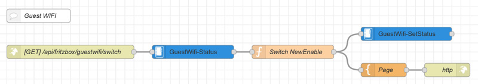
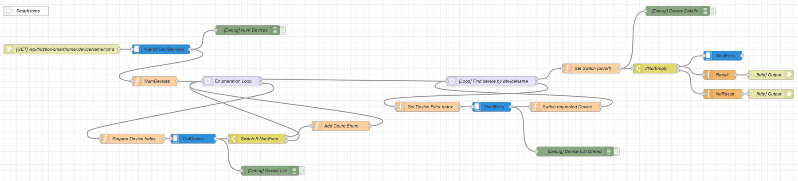

# Node-Red FritzBox TR-064 API Flows

These two flows helps you to control your Guest-WIFI and SmartHome Devices by simple HTTP Endpoints.

The magic is in the second Flow to control your SmartHome Devices. You don't need the AIN (FritzBox Device ID).
***You can just use the name you have given in the FritzBox for your device!***

## Endpoints

* http://[your-nodered-url]:[nodered-port]/api/fritzbox/guestwifi/toggle
* http://[your-nodered-url]:[nodered-port]/api/fritzbox/smarthome/:deviceName

### Example

* http://myred:1880/api/fritzbox/guestwifi/toggle
* http://myred:1880/api/fritzbox/smarthome/livingroomlamp/on
* http://myred:1880/api/fritzbox/smarthome/livingroomlamp/off
* http://myred:1880/api/fritzbox/smarthome/livingroomlamp/toggle

## Requirements

The Flow needs the following palettes:

* node-red-contrib-fritz
* node-red-contrib-loop

## Configuration

Don't forget to change the ***FritzBox-Config*** with your **username** and **password**,
as well as the IP or Hostname for your FritzBox.

## Additional notes

I use this on a Raspberry Pi 2 where i run a ***piHole*** as well.
This RPi has less power consumption and i use a LAN Port directly on the FritzBox, and
a USB port on it for power of the RPi.

To save some energy i disabled the Display Service (HDMI Output) and Bluetooth (on newer RPi's).
To do the same, just run these commands (maybe you'll want to run it on @reboot cronjob if neccessary).

### RPi Power optimizations

    sudo tvservice -o
	systemctl disable hciuart

### See also

See also my "pihole-unique-filterlist-creator" project for optimizing your gravity lists of pihole ;-)